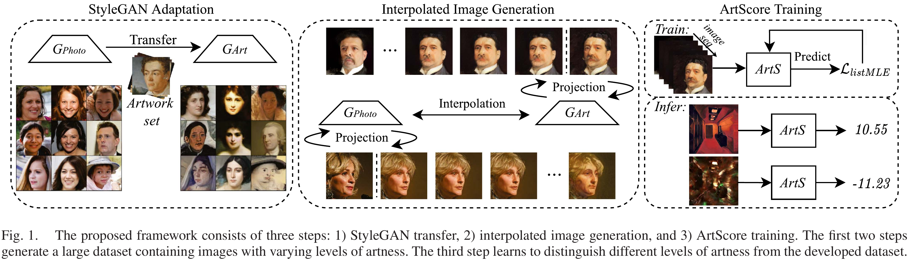
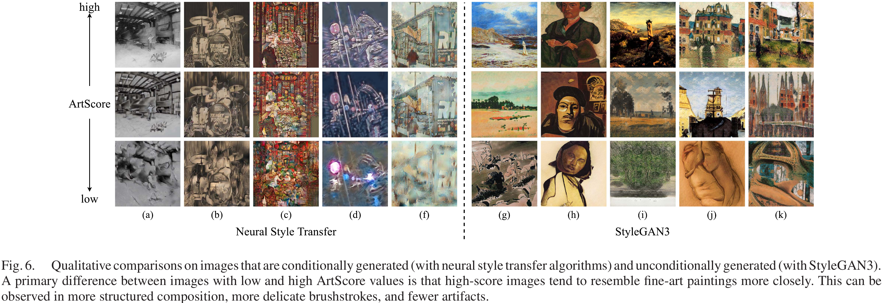

# ArtScore: Learning to Evaluate the Artness of AI-generated Images

This repository provides a PyTorch implementation of ArtScore, a metric designed to evaluate the degree to which an image resembles authentic artworks created by artists, as opposed to photographs.

📄 Paper:[IEEE Link](https://ieeexplore.ieee.org/iel8/6046/4456689/10551508.pdf); [Arxiv](https://arxiv.org/abs/2305.04923)



## Overview

Minimal example for running inference using a pretrained ArtScore model:

```python
import torch
from torch import nn
from torchvision import models, transforms
from PIL import Image

# Load checkpoint and modify the model
ckpt = torch.load('./ckpt/loss@listMLE_model@resnet50_denseLayer@True_batch_size@16_lr@0.0001_dropout@0.5_E_8.pth')
model = models.resnet50()
model.fc = nn.Sequential(
    nn.Linear(2048, 1000),
    nn.ReLU(),
    nn.Dropout(0.5),
    nn.Linear(1000, 1),
)
model.load_state_dict(ckpt)
model.eval()

# Define preprocessing
image_transform = transforms.Compose([
    transforms.Resize(224),
    transforms.ToTensor(),
    transforms.Normalize([0.485, 0.456, 0.406], [0.229, 0.224, 0.225])
])

# Run inference
img_path = '/path/to/an/img.png'
with torch.no_grad():
    image = Image.open(img_path)
    input_tensor = image_transform(image).unsqueeze(0)
    score = model(input_tensor)[0]
    print("ArtScore:", score.item())
```

**Batch Inference:** To perform inference over a folder of images and save the results, refer to [`sh/example_infer.sh`](sh/example_infer.sh).



**Evaluation with Other Metrics**: Use `infer_other_metrics.py` to compute compared metrics that requires content/style reference, including: LPIPS, L2 distance, SSIM, Gram / Content Loss

**Training from Scratch:** To train ArtScore from scratch, first prepare your dataset following `./gen_dataset`. Then, refer to `sh/example_train.sh` for an example training pipeline using 10 sampled image series.


## Cite

If you find this work useful, please consider citing:
```
@article{chen2024learning,
  title={Learning to Evaluate the Artness of AI-Generated Images},
  author={Chen, Junyu and An, Jie and Lyu, Hanjia and Kanan, Christopher and Luo, Jiebo},
  journal={IEEE Transactions on Multimedia},
  volume={26},
  pages={10731--10740},
  year={2024},
  publisher={IEEE}
}
```


